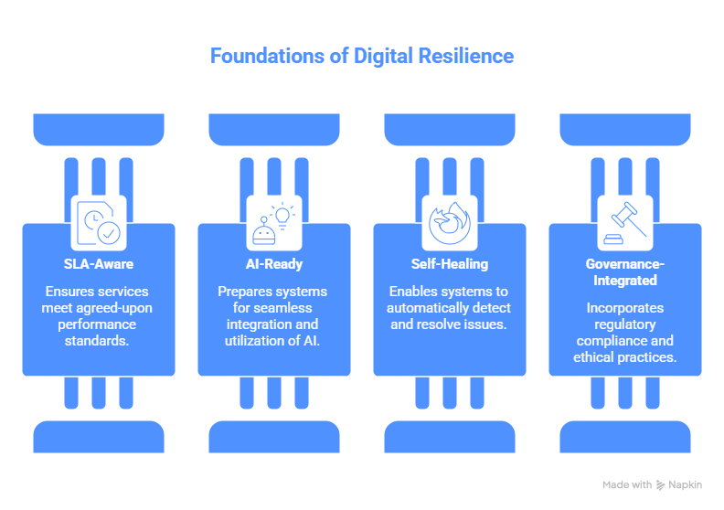
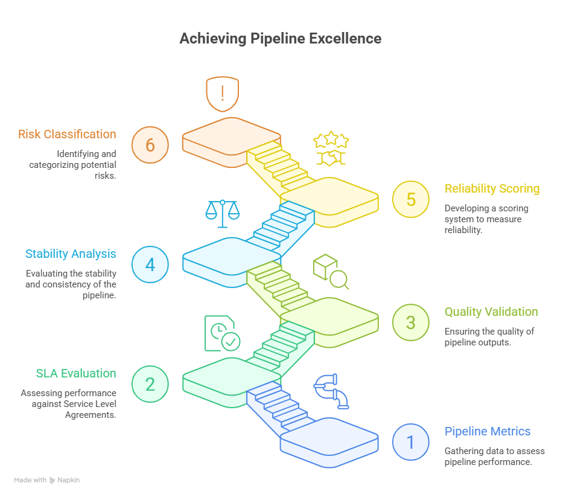
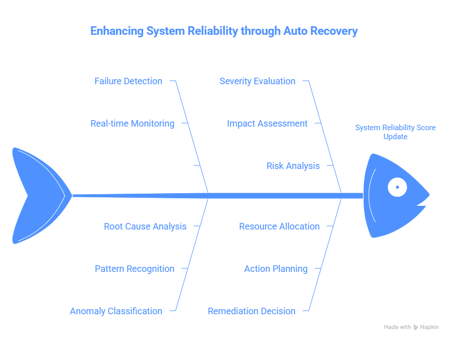

# Self-Healing Data Pipeline Framework


> Open-source research prototype for evaluating policy-constrained failure detection, diagnosis, remediation, post-recovery validation, and escalation workflows in data pipelines.

## Overview

The Self-Healing Data Pipeline Framework is an enterprise-grade autonomous reliability system designed to detect, diagnose, and remediate failures across distributed data pipelines.

Modern data platforms frequently experience failures such as schema drift, delayed source feeds, null spikes, missing partitions, dependency issues, compute exhaustion, and SLA breaches.

Traditional monitoring systems only alert engineers after failures occur. This framework introduces intelligent recovery workflows that automatically restore pipeline health and reduce operational burden.

---

# 📘 Technical Article

Medium Article:  
[Why Traditional Monitoring Systems Are No Longer Enough for Modern Enterprise Data Platforms](https://medium.com/@baharath.bathula/building-a-self-healing-data-pipeline-framework-for-enterprise-reliability-4bfe763fb0f6)

## Trusted Enterprise Use Cases

Designed for regulated and large-scale environments including:

- Insurance analytics platforms
- Financial reporting hubs
- Retail supply chain data systems
- Healthcare ETL environments
- AI / ML feature pipelines

## Core Capabilities

### Telemetry Monitoring

Continuously captures:

- runtime duration
- freshness lag
- row counts
- schema versions
- null percentages
- dependency completion status
- failure logs

### Detection Engine

Automatically identifies:

- schema drift
- missing partitions
- delayed data arrival
- abnormal runtimes
- data quality degradation
- SLA violations

### Diagnosis Engine

Determines probable root causes using:

- execution logs
- metadata lineage
- upstream dependency graphs
- historical incidents
- pipeline health signals

### Remediation Engine

Automatically executes:

- retries
- backfills
- schema remapping
- quarantine bad records
- rerun workflows
- autoscaling recovery
- escalation to operators

### Learning Engine

Stores previous incidents and improves future recovery decisions.

---

# 🏗️ Architecture Diagrams

## Control Plane Architecture



---

## Reliability Scoring Flow



---

# 📊 Operational Reliability Simulation

The repository includes simulated operational artifacts demonstrating:

- reliability scoring
- autonomous remediation
- SLA-aware orchestration
- governance-aware operational resilience
- operational telemetry workflows

# 🖼️ Operational Visualization Assets

The repository includes operational intelligence visualization assets representing:

- reliability trend analysis
- SLA recovery behavior
- incident heatmaps
- operational dashboard concepts
- autonomous remediation workflows
- enterprise telemetry monitoring

These artifacts simulate enterprise operational intelligence workflows for distributed cloud-native systems.

## Example Operational Metrics

| Metric | Value |
|--------|------|
| Reliability Score | 91 |
| SLA Compliance | 96% |
| Recovery Success Rate | 95% |
| Active Incidents | 2 |

## Simulated Operational Workflow

Failure Detection → Reliability Evaluation → Autonomous Remediation → Governance Validation → Operational Recovery

## Autonomous Remediation Workflow



## Business Value

- Reduce downtime
- Improve SLA compliance
- Increase data freshness
- Lower support costs
- Improve trust in analytics and AI systems
- Strengthen enterprise resilience

---

## Example Use Cases

- ETL schema drift recovery
- Missing partition backfill automation
- Delayed API source failover
- Null spike quarantine workflows
- Warehouse load retry orchestration

---

# 📈 Reliability Engineering Visualizations

The framework includes simulated operational intelligence datasets demonstrating:

- reliability trend analysis
- SLA recovery behavior
- incident frequency monitoring
- remediation orchestration
- governance-aware operational telemetry

# 📊 Enterprise Operational Intelligence

The framework includes simulated operational intelligence visualizations representing:

- reliability score stabilization
- SLA recovery behavior
- incident frequency analysis
- autonomous remediation orchestration
- governance-aware operational telemetry

## Visualization Categories

- Reliability Trend Analysis
- SLA Recovery Monitoring
- Incident Heatmaps
- Operational Metrics Summaries
- Reliability Intelligence Tracking

## Visualization Areas

- Reliability score stabilization
- SLA degradation and recovery
- Incident frequency analysis
- Operational intelligence monitoring
- Autonomous remediation tracking

## Future Enhancements

- ML-based failure prediction
- GenAI root cause assistant
- Multi-cloud healing policies
- Natural language incident summaries

---

## Architecture

```text
Sources → Ingestion → Pipeline Jobs → Telemetry Layer
                               ↓
               Detection → Diagnosis → Recovery
                               ↓
                     Warehouse / Lakehouse
                               ↓
                        Audit + Learning
```

---

# 🎤 Presentation & Architecture Assets

The repository includes presentation-ready operational intelligence materials supporting:

- enterprise architecture walkthroughs
- reliability engineering demonstrations
- operational resilience storytelling
- governance-aware operational intelligence
- self-healing infrastructure concepts

Presentation materials are designed for technical demonstrations and enterprise operational discussions.

## Positioning Statement

The Self-Healing Data Pipeline Framework represents an original contribution to autonomous data reliability engineering by combining telemetry, metadata lineage, diagnosis logic, and automated remediation into a unified control plane.

## Market Opportunity

Modern enterprises lose time and revenue from broken pipelines, stale data, and manual remediation. Self-healing data reliability systems reduce operational burden and improve decision speed.

---

## Author

**Baharath Bathula**  
Inventor / Engineer focused on scalable data infrastructure, AI systems, and autonomous enterprise platforms.

Creator of the Self-Healing Data Pipeline Framework.
